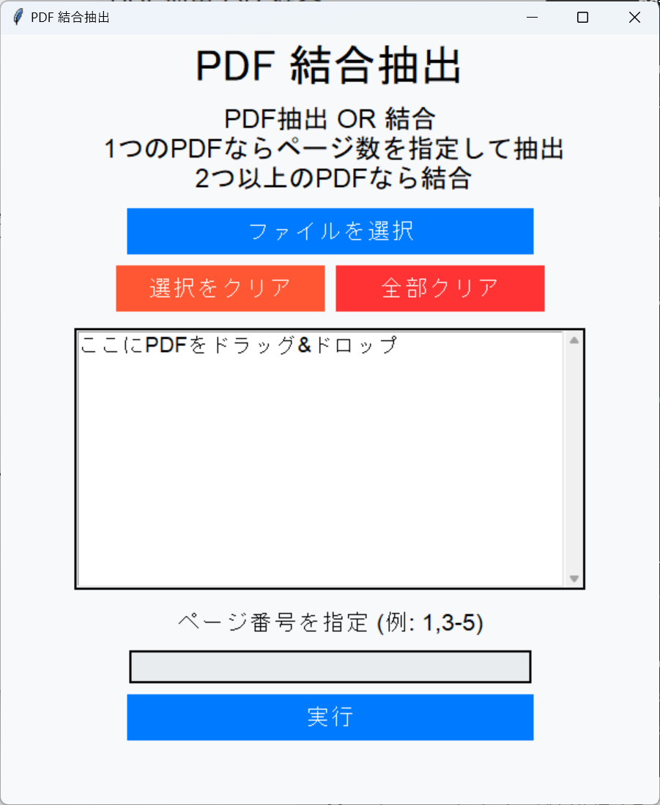

# PDF 結合抽出ツール

このアプリケーションは, PDFファイルの結合および抽出を簡単に行うためのツールです. 1つのPDFファイルから特定のページを抽出したり, 複数のPDFファイルを結合することができます. 




## 機能

- **PDFの抽出**: 1つのPDFファイルから指定したページ番号の範囲を抽出します. 
- **PDFの結合**: 複数のPDFファイルを1つに結合します. 

## 使用方法

1. **ファイルを選択**: 「ファイルを選択」ボタンをクリックして, 処理したいPDFファイルを選択します. または, PDFファイルをドラッグ&ドロップすることも可能です. 
2. **ページ番号の指定**: 抽出したいページ番号を `,` または `-` で区切って指定します (例: `1,3-5`). 結合時にはこのステップは不要です. 
3. **実行**: 「実行」ボタンを押すことで, 選択された操作が実行されます. 

### その他の機能
- **選択をクリア**: 選択したファイルの中から, 任意のファイルをクリアできます. 
- **全部クリア**: 選択した全てのファイルをクリアします. 

## 前提条件

- `Python 3.x`
- `PyPDF2`
- `TkinterDnD2`
- `ttkthemes`

これらのライブラリは, 事前にインストールされている必要があります. 以下のコマンドを実行してインストールしてください:

```bash
pip install PyPDF2 tkinterdnd2 ttkthemes
```

## 実行方法
```bash
python pdfmd.py
```
または, エクスプローラ上でこのファイルを右クリックして, 「このプログラム > Python」を選択してください.
## 使い方の詳細
ファイル選択: ファイルをエクスプローラから選択するか, アプリケーションウィンドウにドラッグ&ドロップします. リストボックスには選択されたファイル名とページ数が表示されます. 
ページ抽出: 1つのPDFファイルを選択した場合, 抽出したいページ番号を指定できます. 複数のPDFを選択した場合は結合が実行されます. 

## 注意事項
抽出ページ番号の指定が正しくない場合, エラーが発生する可能性があります. 
同じファイルを複数回選択することはできません. 


## ライセンス
このプロジェクトは, 自由に使用および改変可能です. 商用利用も可能ですが, 自己責任でご利用ください. 


